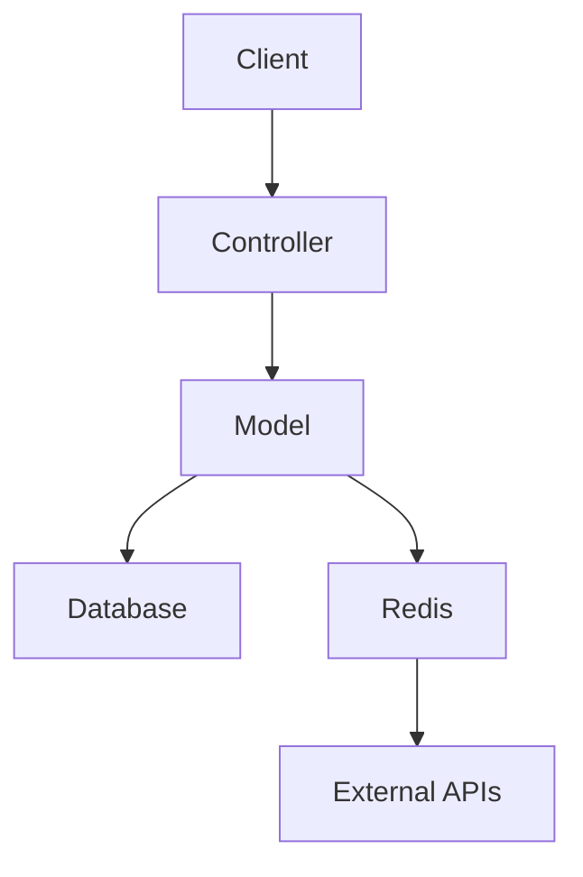
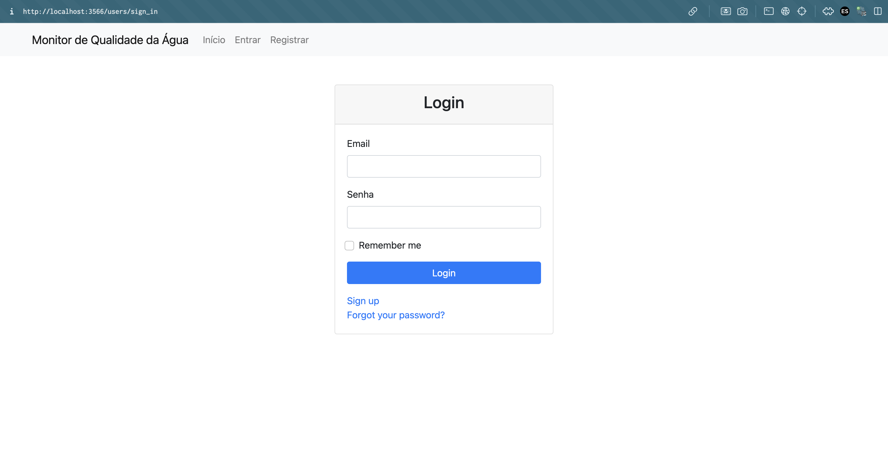
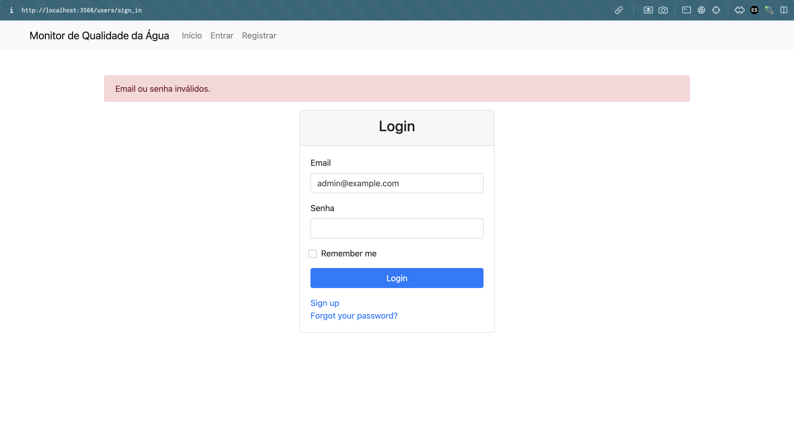
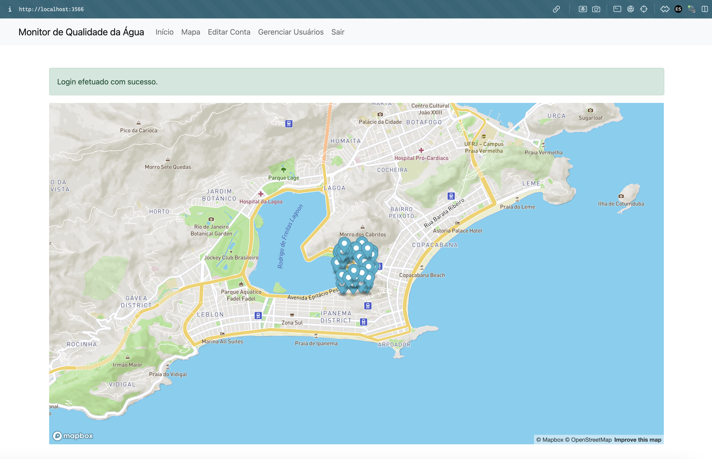
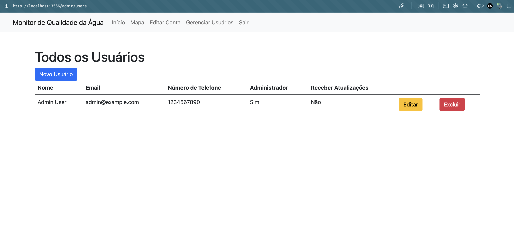
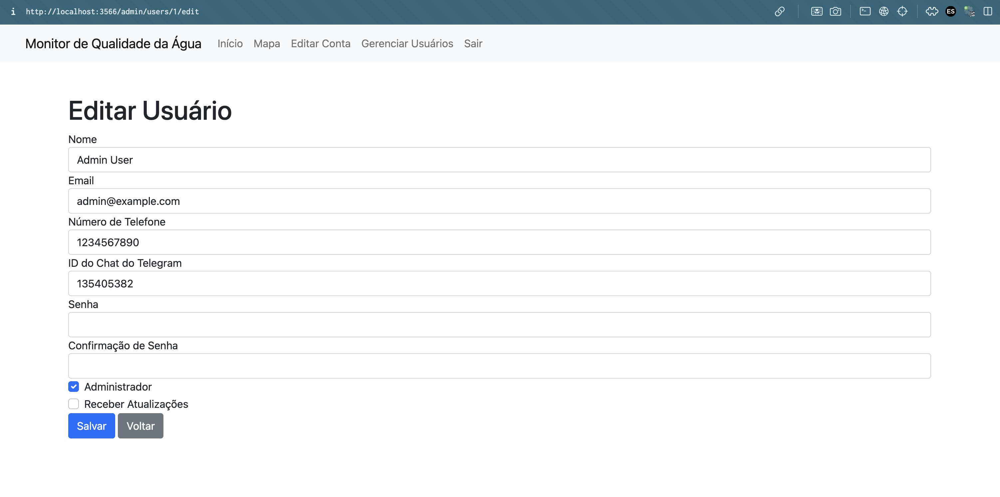
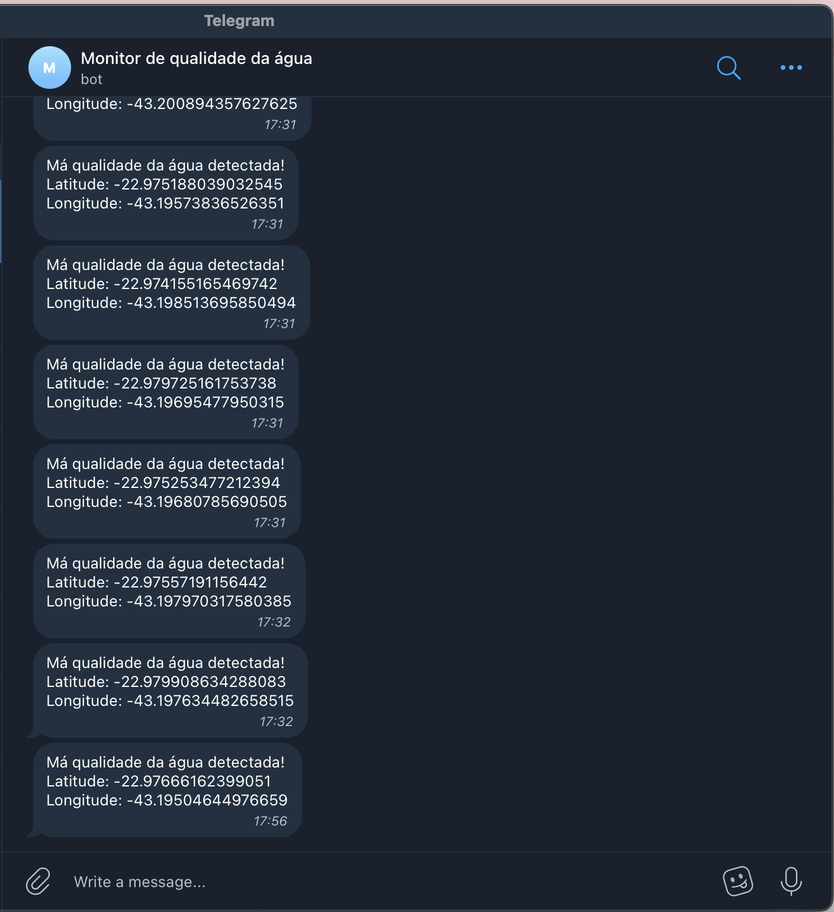

# Water Monitoring System

## Sumário

1. [Breve Descrição](#breve-descrição)
2. [Visão de Projeto](#visão-de-projeto)
3. [Documentação Técnica do Projeto](#documentação-técnica-do-projeto)
4. [Instruções para Iniciar o Projeto com Docker](#instruções-para-iniciar-o-projeto-com-docker)
5. [Exemplos de uso](#exemplos-de-uso)

## Breve Descrição

Este projeto é um sistema de monitoramento da qualidade da água que recebe eventos de estações de monitoramento, armazenando as localizações onde a qualidade da água foi considerada ruim. O sistema permite a gestão de usuários, configurando permissões para o recebimento de notificações via Telegram.

- Criação e gerenciamento de usuários.
- Configuração de permissões para notificações via Telegram.
- Atualização de informações pessoais pelos usuários (nome, telefone e ID do chat do Telegram).
- Envio de notificações para o telegram do usuário quando a qualidade da água é considerada ruim.

Destinado principalmente a gestores ambientais e pesquisadores em qualidade da água, este sistema serve como uma ferramenta utilitária auxiliar para monitoramento ambiental. É importante notar que o sistema requer configuração correta de APIs externas (Telegram e Mapbox) para pleno funcionamento.

Este programa foi inicialmente desenvolvido para disciplina de Computaçõe Móvel, porém apenas com a visualização do mapa. 
A partir disso, foi feito uma extensão para gerenciamento de usuários, monitoramento de qualidade da água e notificação via Telegram.

Ressalvas: Necessidade de configuração correta das APIs externas (Telegram e Google Maps) para pleno funcionamento.

## Visão de Projeto

### Cenários Positivos

#### Cenário Positivo 1: Cadastro de Usuário para Recebimento de Notificações

João está preocupado com a qualidade dos corpos de água de seu bairro. Ele decide utilizar o sistema de monitoramento da qualidade da água para receber notificações via Telegram sempre que houver um problema na qualidade da água. João acessa a aplicação e, como administrador, cadastra um novo usuário para si mesmo, fornecendo seu nome, telefone e ID do chat do Telegram. Ao concluir o cadastro, João verifica que recebeu uma mensagem de boas-vindas do bot do Telegram, confirmando que o cadastro foi realizado com sucesso e que ele começará a receber notificações.

#### Cenário Positivo 2: Atualização de Informações de Contato

Recentemente, João alterou seu número de telefone e seu ID do chat do Telegram. Ele sabe que precisa atualizar essas informações no sistema para continuar recebendo notificações sobre a qualidade da água. João faz login na aplicação, acessa a página de edição de conta e atualiza seu número de telefone e o ID do chat do Telegram. Ele salva as alterações e recebe uma notificação de confirmação do bot do Telegram informando que suas informações foram atualizadas com sucesso.

#### Cenário Positivo 3: Visualização de Pontos com Má Qualidade da Água

João quer visualizar todos os pontos com má qualidade de água no mapa da aplicação. Ele faz login no sistema e acessa a página do mapa. Nesta página, ele vê marcadores indicando as localizações onde a qualidade da água foi considerada ruim. Isso permite que João tenha uma visão clara e rápida dos locais críticos, ajudando-o a tomar decisões informadas sobre as áreas que precisam de mais atenção.

### Cenários Negativos

#### Cenário Negativo 1: Erro ao Cadastrar Usuário Sem Chat ID do Telegram

Marcos, também um administrador, tenta cadastrar um novo usuário na plataforma, configurando-o para receber notificações via Telegram. No entanto, ele se esquece de inserir o ID do chat do Telegram do novo usuário. Quando ele tenta salvar o cadastro, o sistema exibe uma mensagem de erro informando que o ID do chat do Telegram é obrigatório para usuários que desejam receber notificações. Para resolver isso, Marcos orienta o novo usuário a obter seu chat ID utilizando o bot RawDataBot no Telegram. O usuário inicia uma conversa com o RawDataBot, envia qualquer mensagem, e o bot responde com o chat ID, que ele então fornece a Marcos para completar o cadastro corretamente.

#### Cenário Negativo 2: Falha no Recebimento de Notificações

Maria cadastra seu usuário com sucesso no sistema, incluindo seu nome, telefone e ID do chat do Telegram. No entanto, ela percebe que não está recebendo notificações sobre a qualidade da água. Maria verifica as configurações do sistema e percebe que pode haver um problema com o bot do Telegram configurado. Ela consulta a documentação do projeto e segue as instruções para verificar e configurar corretamente o bot ID do Telegram. Maria abre o Telegram e inicia uma conversa com o BotFather, usando o comando `/newbot` para criar um novo bot. Após seguir as instruções do BotFather, ela obtém um token de API para o novo bot, que ela então insere nas credenciais do Rails. Após essa configuração, Maria começa a receber as notificações corretamente.

## Documentação Técnica do Projeto

Sumário

1. [Especificação de Requisitos](#especificação-de-equisitos)
   * [Requisitos Funcionais](#requisitos-funcionais)
   * [Requisitos Não-Funcionais](#requisitos-não-funcionais)
2. [Modelo de Arquitetura](#modelo-de-arquitetura)
3. [Arquitetura do Sistema](#arquitetura-do-sistema)
4. [Modelo de Dados](#modelo-de-dados)
5. [Descrição Funcional](#descrição-funcional)
6. [Sobre o Código](#sobre-o-código)
7. [Linguagem e Técnicas de Programação](#linguagem-e-técnicas-de-programação) 
8. [Estratégia de Comentários](#estratégia-de-comentários)
9. [Diretivas de Compilação](#diretivas-de-compilação)

### Requisitos Funcionais

1. Cadastro de Usuários:
   * Sistema deve permitir o cadastro de novos usuários.
   * O administrador pode configurar permissões de recebimento de notificações via Telegram.
2. Atualização de Informações do Usuário:
    * O sistema deve permitir que os usuários atualizem suas informações pessoais (nome, telefone, ID do chat do Telegram).
3. Recebimento de Eventos de Monitoramento:
    * O sistema deve receber e armazenar eventos de localização de estações de monitoramento da qualidade da água.
4. Visualização de Dados no Mapa:
    * O sistema deve exibir um mapa com marcadores indicando locais com qualidade de água ruim.
5. Notificações via Telegram:
    * O sistema deve enviar notificações via Telegram para os usuários que têm essa permissão configurada.

### Requisitos Não-Funcionais

1. Desempenho:
  * O sistema deve processar e exibir os eventos de monitoramento em tempo real.
2. Segurança:
  * As informações dos usuários devem ser protegidas por autenticação e autorização adequadas.
  * As credenciais da API devem ser armazenadas de forma segura.
3. Usabilidade:
  * A interface deve ser intuitiva e fácil de usar para administradores e usuários comuns.
4. Confiabilidade:
  * O sistema deve ser robusto e lidar adequadamente com falhas na recepção de eventos e no envio de notificações.

### Modelo de Arquitetura

#### Arquitetura do Sistema

A arquitetura do sistema é baseada no padrão MVC (Model-View-Controller), utilizando o framework Ruby on Rails. A seguir, um diagrama simplificado da arquitetura:



### Modelo de Dados

1. User
  * Campos: id, name, email, phone_number, telegram_chat_id, admin, receive_updates, created_at, updated_at
  * Relacionamentos: N/A
2. Location
  * Campos: id, latitude, longitude, created_at, updated_at
  * Relacionamentos: N/A

#### Modelo de Interação com APIs

1. Telegram Bot API:
   * Utilizada para enviar notificações aos usuários.
   * Requer configuração do bot token.
2. Mapbox API:
   * Utilizada para exibir a localização dos eventos de monitoramento no mapa.
   * Requer configuração da API key.

### Descrição Funcional

#### Fluxo de Cadastro de Usuário

1. O administrador acessa a página de cadastro de usuário.
2. O administrador preenche as informações necessárias (nome, telefone, ID do chat do Telegram).
3. O administrador configura as permissões de notificação.
4. O sistema salva o novo usuário e envia uma mensagem de boas-vindas via Telegram.

#### Fluxo de Atualização de Informações do Usuário

1. O usuário faz login e acessa a página de edição de conta.
2. O usuário atualiza suas informações pessoais.
3. O sistema salva as alterações.

#### Fluxo de Recebimento de Eventos de Monitoramento

1. As estações de monitoramento enviam eventos de localização para o sistema.
2. O sistema processa os eventos e armazena os dados no banco de dados.
3. O sistema atualiza o mapa com os novos pontos de qualidade da água.

#### Fluxo de Notificações via Telegram

1. O sistema identifica os usuários que devem receber notificações.
2. O sistema envia uma mensagem via Telegram com as informações relevantes sobre a qualidade da água.

### Sobre o Código

#### Linguagem e Técnicas de Programação

* O projeto é desenvolvido em Ruby on Rails.
* Utiliza PostgreSQL como banco de dados.
* Utiliza Redis e Sidekiq para gerenciamento de filas e processamento em background.
* Integração com APIs externas via HTTP.

#### Diretivas de Compilação

* O projeto não requer diretivas de compilação específicas.
* Utiliza Bundler para gerenciamento de dependências.
* Credenciais são gerenciadas pelo Rails Encrypted Credentials.


### Manual de Utilização para Usuários Contemplados

---

#### 1. Criar Usuário Admin

**Guia de Instruções:**

Para criar um usuário admin, faça:

**Passo 1:** Faça login na aplicação utilizando suas credenciais de administrador.

**Passo 2:** No menu de navegação, clique em "Gerenciar Usuários".

**Passo 3:** Clique no botão "Novo Usuário".

**Passo 4:** Preencha o formulário com as informações do novo usuário (nome, email, telefone, ID do chat do Telegram, senha).

**Passo 5:** Marque a opção "Administrador" para designar o usuário como administrador.

**Passo 6:** Configure as permissões de recebimento de notificações via Telegram, se necessário.

**Passo 7:** Clique no botão "Salvar".

> Alternativamente, se houver um processo automatizado de importação de usuários, utilize-o conforme as instruções específicas do sistema.

**Exceções ou potenciais problemas:**

Se o usuário não puder ser criado porque o email já está em uso:

**Então faça:** Verifique se o usuário já existe no sistema e edite as informações necessárias.

Se o ID do chat do Telegram não estiver disponível no momento do cadastro:

**Então faça:** Oriente o usuário a obter seu ID do chat utilizando o bot RawDataBot no Telegram e adicione essa informação posteriormente.

---

#### 2. Criar Usuário Regular

**Guia de Instruções:**

Para criar um usuário regular, faça:

**Passo 1:** Faça login na aplicação utilizando suas credenciais de administrador.

**Passo 2:** No menu de navegação, clique em "Gerenciar Usuários".

**Passo 3:** Clique no botão "Novo Usuário".

**Passo 4:** Preencha o formulário com as informações do novo usuário (nome, email, telefone, ID do chat do Telegram, senha).

**Passo 5:** Não marque a opção "Administrador" para que o usuário seja um usuário regular.

**Passo 6:** Configure as permissões de recebimento de notificações via Telegram, se necessário.

**Passo 7:** Clique no botão "Salvar".

**Exceções ou potenciais problemas:**

Se o usuário não puder ser criado porque o email já está em uso:

**Então faça:** Verifique se o usuário já existe no sistema e edite as informações necessárias.

Se o ID do chat do Telegram não estiver disponível no momento do cadastro:

**Então faça:** Oriente o usuário a obter seu ID do chat utilizando o bot RawDataBot no Telegram e adicione essa informação posteriormente.

---

#### 3. Editar Informações de Usuário

**Guia de Instruções:**

Para editar informações de usuário, faça:

**Passo 1:** Faça login na aplicação.

**Passo 2:** Clique no seu nome de usuário no canto superior direito e selecione "Editar Conta".

**Passo 3:** Atualize as informações desejadas (nome, telefone, ID do chat do Telegram).

**Passo 4:** Clique no botão "Salvar".

> Se você for um administrador e deseja editar informações de outro usuário:

**Passo 1:** Faça login na aplicação utilizando suas credenciais de administrador.

**Passo 2:** No menu de navegação, clique em "Gerenciar Usuários".

**Passo 3:** Selecione o usuário que deseja editar.

**Passo 4:** Atualize as informações desejadas (nome, telefone, ID do chat do Telegram, permissões).

**Passo 5:** Clique no botão "Salvar".

**Exceções ou potenciais problemas:**

Se o usuário não puder salvar as alterações porque as informações são inválidas:

**Então faça:** Verifique as mensagens de erro exibidas e corrija as informações necessárias.

Se o ID do chat do Telegram não estiver correto:

**Então faça:** Oriente o usuário a obter seu ID do chat utilizando o bot RawDataBot no Telegram e atualize essa informação.

---

#### 4. Visualizar o Mapa com Eventos em Tempo Real

**Guia de Instruções:**

Para visualizar o mapa com eventos em tempo real, faça:

**Passo 1:** Faça login na aplicação.

**Passo 2:** No menu de navegação, clique em "Mapa".

**Passo 3:** Visualize o mapa com os marcadores indicando locais com qualidade de água ruim.

**Exceções ou potenciais problemas:**

Se o mapa não carregar corretamente:

**Então faça:** Verifique sua conexão com a internet e recarregue a página.

Se os marcadores no mapa não aparecerem:

**Então faça:** Verifique se há eventos registrados no sistema. Se necessário, adicione eventos de teste para verificar a funcionalidade.


## Instruções para Iniciar o Projeto com Docker

Certifique-se de ter o Docker e o Docker Compose instalados em seu sistema.

### Configurar Credenciais do Rails

1. Gere as credenciais do Rails (se ainda não tiver):

   ```bash
   EDITOR="code --wait" bin/rails credentials:edit
   ```

   Adicione o token para o telegram (não compartilhado aqui por motivos de segurança. Posso fornecer o que estou usando)

2. Inicie os containers:

```bash
docker-compose up --build
```

3. Acesse a página:

```bash
http://localhost:3566
```

O setup faz seed de um usuário de teste que não tem notificações habilitadas:

```bash
user: admin@example.com
passwd: password
```

Há um processo de gera eventos nas proximidades do mapa. 
Caso tenha o bot do telegram configurado, modifique o usuário de teste para receber notificações:

1. Marque a opção de receber notificações
2. Altere telegram chat it para o seu usuário do telegram (Utilize o @RawDataBot para obter o seu id)

### Exemplos de uso

#### Login



#### Login com erro



#### Mapa




#### Gerenciar usuários



#### Editar usuário



#### Notificações no telegram




   
